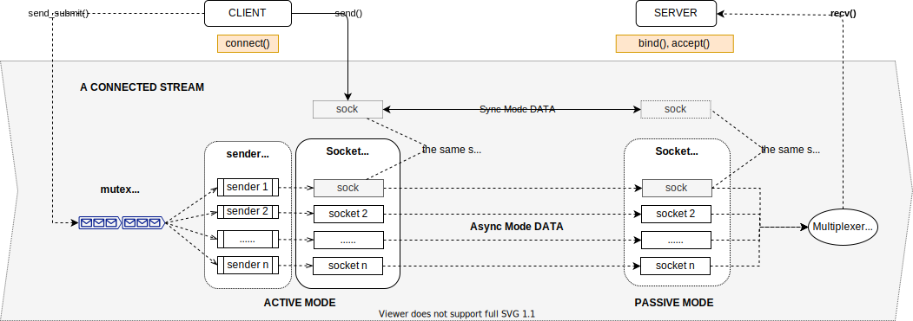

# fperf

- [fperf](#fperf)
  - [Overall](#overall)
  - [Concept](#concept)
    - [STREAM](#stream)
    - [STREAM 的内部结构](#stream-%E7%9A%84%E5%86%85%E9%83%A8%E7%BB%93%E6%9E%84)
    - [发送数据时的考虑](#%E5%8F%91%E9%80%81%E6%95%B0%E6%8D%AE%E6%97%B6%E7%9A%84%E8%80%83%E8%99%91)
    - [MPRTT，NODELAY, QUICKACK](#mprttnodelay-quickack)
      - [MPRTT](#mprtt)
      - [WHY MPRTT](#why-mprtt)
      - [Nagle's Algorithm 和 Delayed ACK](#nagles-algorithm-%E5%92%8C-delayed-ack)
      - [Nagle's Algorithm](#nagles-algorithm)
      - [TCP delayed acknowledgment](#tcp-delayed-acknowledgment)
    - [时延的计算](#%E6%97%B6%E5%BB%B6%E7%9A%84%E8%AE%A1%E7%AE%97)
    - [BLOCK 和 NONBLOCK](#block-%E5%92%8C-nonblock)
    - [n streams](#n-streams)
  - [参数回看](#%E5%8F%82%E6%95%B0%E5%9B%9E%E7%9C%8B)

## Overall

fperf 工具旨在评估特定网络的 TCP，UDP，RDMA 的带宽（bw，BandWidth）及发送-接收延迟（lat，Latency）。

fperf 是一个Client-Server架构的工具。服务端和客户端都共用一个单一的可执行文件`fperf`，fperf 的使用基本流程是：

1. 先在服务端主机运行命令`fperf -s`，以启动服务；
2. 然后在客户端主机运行命令`fperf -c <ip_or_hostname_of_the_server>`，连接服务端，以默认参数开始传输数据并生成报告。

服务端的运行结果

```bash=
$ ./fperf -s

Server listening .... new TCP connection from 127.0.0.1:50384. pkt_size(32KB)
received : 10240MB(10.00GB 10737418240B) in 2.83s. (bw: 3.54GB/s 28Gbit/s)
latency  : avg=8.53us   min=1.46us      max=129.76us
```

服务端报告解读：

- 第一行：接受到一个新的`TCP`类型的连接，准备以 32KB 的缓冲区大小接收数据；
- 第二行：在2.83秒的时间内收到了10240MB（10GB) 数据，带宽为28Gbit/s；
- 第三行：时延信息，平均接收时延8.53微秒，最小接收时延1.46微秒，最大接收时延129.76微秒。

客户端的运行结果：

```bash
$ ./fperf -c 127.0.0.1 

TCP CLIENT => 127.0.0.1:28444 pkt_size=32768B sync(no-queue) nsockets=1
sent      : 10240MB(10.00GB 10737418240B) in 2.83s. (bw: 3.54GB/s 28Gbit/s)
latency   : avg=8.62us  min=5.09us      max=74.84us
```

客户端报告解读：

- 第一行：`TCP` 类型的客户端连接到服务器的`28444`端口，准备以 32768B (32KB) 的缓冲区大小传输数据；
- 第二行：在2.83秒的时间内发送了 10240MB (10GB) 数据，带宽为28Gbit/s；
- 第三行：时延信息，平均发送时延8.62微秒，最小发送时延5.09微秒，最大发送时延74.84微秒。

上述为默认参数下运行结果的报告。当给 fperf 指定不同的参数时，报告格式可能不同。

fperf 工具的命令行参数有：

```bash=
$ ./fperf -h
'fperf' measures UDP/TCP/RDMA bandwidth and latency.

Usage: fperf --server | --client server_name
  -t, --nstreams n        number of streams
  -n, --nsockets n        number of sockets per stream
  -u, --udp               use UDP  (default TCP)
  -R, --rdma              use RDMA (default TCP)
  -D, --rdmadev devname   RDMA NIC name (use the first found by default)
  -m, --mb n              n MB to send (default 10240 MB)
  -r, --mprtt             'most-practicle-round-trip-time' wait for ack before sending next
  -l, --pktsize           packet size in BYTE (default 32768)
  -q, --qtype             queue type: 1: mutex queue(default), 0: lockfree queue
  -d, --nodelay           for TCP only, add TCP_NODELAY flag to disable nagle's algorithm
  -a, --quickack          for TCP only, add TCP_QUICKACK flag to disable delayed ack algorithm
```

各个参数的含义：

 短格式           | 长格式                 | 解释
 ----------------|-----------------------|--------------------------
 -s              | --server              | 使 fperf 以服务端模式运行
 -c server_name  | --client server_name  | 使 fperf 以客户端模式运行
 -n n            | --nsockets n          | 同一个stream里开启`n`个`socket`
 -R              | --rdma                | 使用`RDMA`协议（默认使用`TCP`协议)
 -D devname      | --rdmadev devname     | 使用`RDMA`协议时使用的设备名（默认使用第一个被发现的RDMA设备）
 -u              | --udp                 | 使用`UDP`协议（默认使用`TCP`协议)
 -m n            | --mb n                | 总共传输 n MB 字节，默认 10GB
 -r              | --mprtt               | **`most-practicle-round-trip-time`** 选项，在发送下一个包之前必须等待对端回应
 -l              | --pktsize n           | 每次发送的缓冲区大小 (默认32KB)
 -q 0\|1         | --qtype 0\|1          | 当使用多个 socket 进行传输时，在stream内部使用哪种类型的队列。0 指定使用无锁队列，1 指定使用有锁队列（mutex队列）
 -d              | --nodelay             | 打开TCP连接的TCP_NODELAY标志（禁用 Nagle's Algorithm）
 -a              | --quickack            | 打开TCP连接的TCP_QUICKACK标志（禁用 DELAYED ACK 算法）

在深入理解各参数含义之前，应该先了解一些`fperf`中的主要概念。

## Concept

fperf 的主要工作步骤为：

1. 服务端先于客户端运行，创建一个 `控制STREAM` 并等待客户端的连接；
1. 客户端后运行，创建一个 `控制STREAM` 并连接到服务端的控制STREAM；
1. 服务端和客户端通过`控制STREAM`交换设置；
1. 服务端根据设置创建一个或多个 `数据STREAM` 并等待客户端连接；
1. 客户端创建 `数据STREAM`并连接服务端的数据STREAM；
1. 客户端根据设置的大小发送数据到服务端，默认发送数据大小为10GB，单次发送的用户数据包大小为32KB；
1. 数据发送接收完成，服务端和客户端各自打印自身的报告。

fperf 工具最主要的核心组件就是 `STREAM` 对象.

### STREAM

STREAM 对象是 fperf 的核心对象。一个 STREAM 对象代表了一个端点（endpoint)，和与之连接的另一个 STREAM 对象共同组成了一个跨网络节点的字节流的通道。可以使用标准的 `read/write` 系统调用读写 STREAM 对象（RDMA类型的STREAM除外）。

STREAM 对象的典型使用方法是：

1. 在服务端创建一个 STREAM 对象，调用其 `bind()` 和 `accept()` 方法使其进入被动模式等待客户端的连接；
1. 然后在客户端创建一个 STREAM 对象，调用其 `connect()` 方法进入主动模式连接服务端的 STREAM 对象，完成一个流通道的创建；
1. 服务端和客户端通过读写各自的 STREAM 对象，通过网络发送或接收数据。

服务端和客户端的 STREAM 对象实际都是相同的类型，只是在创建后使用不同的函数使其进入不同的模式。
在实现上，`class f_stream_interface` 是 STREAM 对象的通用接口，实现了适用于各种连接协议的通用方法。`f_stream_tcp` 和 `f_stream_udp`，以及`f_stream_rdma*` 对象则继承于 `f_stream_interface`，对应 TCP 和 UDP 以及 RDMA 的特殊实现。

🎶 注：RDMA 最基本的编程模型是基于 `libibverbs` 库。与传统的 `socket` 库的编程流程有很大的不同。经过多年的发展，RDMA 社区在 `libibverbs` 库的基础上又开发出了一些封装库，例如管理连接的 `librdmacma` 库，以及使 RDMA 编程流程与 `socket` 编程统一的 `rsocket` 库。因此，在 fperf.hpp 头文件中有三种 RDMA 的实现：`f_stream_rdma_cm`，`f_stream_rdma_rsocket`，`f_stream_rdma_ibverbs`，分别对应 3 种 RDMA API。在编译时修改 `using f_stream_rdma = f_stream_rdma_ibverbs;` 可以决定使用哪一种实现。

🎶 需要注意的是，`rsocket api` 虽然最符合熟悉的 `socket` 编程的习惯。但它的资料，例子程序不多，社区不够活跃，讨论和支持似乎也不够。属于比较冷门的库。RDMA API 被设计为更贴近硬件实现的 VERBS 的形式，是为了能灵活完全地控制硬件的各项设置，以达到高性能的目标。因此 fperf 默认还是采用了 `libibverbs` 的实现。

### STREAM 的内部结构

STREAM 对象内部结构如下图所示：



一个网络流由两个相互连接的 STRAM 对象组成。其中一个是 `主动模式STREAM`，由客户端创建；另一个是 `被动模式STREAM`,由服务端创建。
当连接成功后，主动和被动模式的两个 STREAM 对象其实都没有区别，都可以通过读写向对端发送数据。

成功连接后，客户端或者服务端可以通过 send/recv 函数，或者 read/write 函数在 STREAM 上发送和接收数据。

一个 STREAM 对象内部可以支持多个 socket，以便利用多线程的能力来提升数据传输性能。在创建 STREAM 对象时可以指定 STREAM 内部的 nsockets 数量（fperf 工具的 `-n` 参数就指定了nsocks数量）。nsockets 数量就代表了一个 STREAM 对象内部的 sender 线程的数量和 socket 的数量。

当调用 STREAM 对象的 accept() 或 connect() 方法时，STERAM 对象会按照指定的 nsockets 数量，创建对应数量的 socket，并将这些 socket 保存在内部的一个 `Socket Vector`(_vsocks) 结构中。然后还会创建相应数量的 sender 线程，每个线程对应一个 socket，负责通过对应的 socket 发送数据到对端。

客户端或服务端程序可以调用 STREAM 对象的 `send_submit()` 函数将发送请求提交到 STREAM 内部的一个队列（队列的类型可以在创建 STREAM 对象时指定为传统的有锁 MUTEX 队列或无锁队列）。后续这些请求将由 sender 线程负责从队列中取出，并通过网络发送给对端。程序可以使用`sender_drain()`方法等待，直到所有已提交的请求发送完毕。

如果在 STREAM 内部有多个 sockets，其中比较特殊的是第一个(保存在_vsocks[0])。第一个 socket 被用在同步调用路径。
程序调用 send() 函数时，只使用第一个socket用来同步发送数据并等到发送结束才会返回。

与发送时不同的是，STREAM 并不会为接收创建多个线程，而是通过多路复用 (`poll`)。在多个 socket 上接收数据。用户程序可以调用 STREAM 对象的`recv()`函数，或者 `read()` 系统调用 (read/write 系统调用只从第一个socket读取/写入数据) 在 STREAM 对象上接收数据。这些调用都是同步的，可能会使得调用者阻塞（使用recv时可以指定一个timeout值）。

> ⚠️ 注意： 当 TCP STREAM 内部含有多个 socket 且发送端使用 send_submit() 时，发送端使用多线程，接收端使用 multiplexing。由于数据到达对端 socket 的顺序未知，STREAM 不能保证接收和发送的顺序相同。这种情况下 STREAM 接收端将多个 socket 上接收到的数据汇聚成同一个数据流。但这种数据流可能是乱序的，仅能用于评估性能，不能用于真正的数据传输。如果一定要保证数据流的顺序，发送端只能用 nsockets 为 1 来初始化 STREAM 对象，或者只用 send() 函数发送同步数据，以保证只有一个 socket (_vsocks[0]) 被用于数据传输。

🎶 fperf 使用 POSIX `poll` 而非 Linux `epoll`，因为 fperf 每个 STREAM 默认的 nsockets 上限被限制在100个以内。而实际使用中，STREAM 对象一般只创建1个，最多可能只有几个socket就足够了。在 socket 数量不多的情况下使用 `poll` 和 `epoll` 在效率上的差别不大。

### 发送数据时的考虑（TCP和UDP）

通过 `send_submit()` 或使用 `send()` 函数，都能将数据发送给对端。区别在于 `send_submit()` 是异步的，可以利用多线程的能力加速数据的处理。在CPU单核成为瓶颈的情况下或许能提高对网络带宽的利用。

异步发送数据并不总是最优的。在传统的基于信号量(或者叫MUTEX，互斥锁)的队列上，锁竞争，线程的切换可能会带来额外的时延。但是这种情况随着操作系统的更新，以及硬件架构的提升，其实反映得并不十分糟糕。

随着处理器核数的增加，为了改善这种锁竞争和线程频繁切换情况，近些年比较流行的是使用无锁队列。无锁队列的消费者线程一般是在某个CPU核上绑定并忙等新的请求，独占一个核的CPU时间片，因此无需在睡眠唤醒之间频繁切换，节省了上下文切换和系统调用的次数。

fperf 的 STREAM 在创建时支持有锁队列和无锁队列（fperf 工具的 `-q` 参数）。可以尝试不同的选项以评估各自的性能。

> ⚠️ 注意：fperf 目前的无锁队列主要 copy 并修改自 'folly' 项目的 `ProducerConsumerQueue`。目前只支持一个 Producer 和一个 Consumer。
> 在 fperf 工具中，由于主程序的唯一处理就是不停用 `send_submit()` 提交请求，因此 fperf 工具使用无锁队列的效果预期和直接的同步调用 `send()` 类似。

### MPRTT，NODELAY, QUICKACK

#### MPRTT

fperf `-r` 参数，统计 ROUND TRIP 的时间。指定 `-r` 参数后，发送端在每次发送一次数据后，会等待对端返回一个ACK，然后才继续发送下一个数据。如果等待ACK超时（UDP可能丢包），则发送端会重新发送数据，然后继续等待ACK，直到重试失败10次。而接收端在每接收到一个数据后，会发送一个ACK。

不可避免地，由于UDP丢包的可能性和 fperf 的重试设定。当 `-r` 参数指定时，有可能由于数据在网络丢失，或者ACK丢失，STREAM 对象会尝试重发数据，导致服务端实际接收到的数据量和命令行指定的数据量不一样。在严肃的场合里，应该实现某种flow control（sliding window）算法来进行处理。但在 fperf 中，保留这种不一致，反而可以用于计算重试的次数以及丢包率。

下面的例子中，客户端使用 UDP 默认发送 10GB (**10737418240B**) 的数据到 fperf 服务端。而服务端实际接收到(**10737451008B**)，多收到了32768B，说明有一个ACK丢失，客户端重试发送过一次数据。

客户端统计中的 "received"，表示收到的ACK的总字节数。由于 fperf 的 ACK 为1字节大小（后面讲解原因）327680B 表示总共收到了 327680 个ACK。327680 * 32768 = 10GB。

```bash
# 客户端统计
$ ./fperf -c localhost -r -u
UDP STREAM 0 127.0.0.1:33466 => 127.0.0.1:49996 pkt_size=32768B sync(no-queue) nsockets=1
sent      : 10240MB(10.00GB 10737418240B) in 7.86s. (bw: 1.27GB/s 10Gbit/s)
received  : 0MB(0.00GB 327680B)
mprtt     : avg=23.97us    min=22.43us    max=178.28us

# 服务端统计
$ ./fperf -s

Server listening .... new UDP connection from 0.0.0.0:33466. pkt_size(32768B)
received : 10240MB(10.00GB 10737451008B) in 7.84s. (bw: 1.28GB/s 10Gbit/s)
mprtt    : avg=23.92us    min=15.13us    max=200.49us

Server listening .... 
```

#### WHY MPRTT

不同于 TCP 协议本身在握手阶段的 **RTT** (Round Trip Time) 时间，fperf 的 **MPRTT** (Most Practicle Round Trip Time) 时间也应用在 UDP 上，旨在反映最为贴近用户应用程序所直接感受到的时延。

客户端发送一个较大的数据包，服务器发回一个较小的ACK包，这是现实中比较常用的一种通讯序列。MPRTT 主要评估这种情况下的时延。

这种模式所造成的网络消耗很大。比如使用TCP IPV4网络时，TCP HEADER有40字节。假设用户数据ACK只有一个字节，那么整个IP包41字节，其中只有1个字节的PAYLOAD。这样发送和接收数据会造成严重的资源浪费和网络拥堵。如果使用UDP协议，情况稍微会好一些，但UDP的IP HEADER也有20字节，因此还是会造成带宽浪费。

为了放大这种情况，当 `-r` 参数被指定的时候，fperf 发送的 ACK 被设置为1个字节。

实际上，使用TCP协议时，情况可能还会更糟糕。因为在80年代初期引入的两个优化算法：**Nagle's Algorithm** 和 **Delayed ACK**，后续被证明是互斥的。如果两个算法同时打开 (大多数情况下两者都是默认打开的)，可能会导致持续的200ms~500ms的高时延。

#### Nagle's Algorithm 和 Delayed ACK

简单来说，Nagle's Algorithm 是希望通过聚合多个小的TCP发送请求到一次网络传输中，以增加对网络带宽的利用。而 Delayed ACK 则是希望聚合多个 ACK 到一次网络传输中，以提高网络性能。

然而不幸的是，两个算法来自于两个不相关的实体（Nagle和Berkeley)，且差不多同一时间进入了TCP标准。他们互相不知道对方的工作。直到两个算法被大量的实现才发现两者的工作方式实际是互斥的，可能会导致发送和接收端相互等待，直到超时。

这两者都对带宽友好，是TCP流控和拥塞控制的一部分，其目的是尽量占满网络带宽。而他们对于时延敏感的应用却不够友好。所以对于严格要求低时延的应用，UDP可能更为合适。

#### Nagle's Algorithm

参见维基百科 [Nagle's algorithm](https://en.wikipedia.org/wiki/Nagle%27s_algorithm)。fperf 允许使用 `-d --nodelay` 参数禁用TCP的 Nagle's Algorithm。

#### TCP delayed acknowledgment

参见维基百科 [TCP delayed acknowledgment](https://en.wikipedia.org/wiki/TCP_delayed_acknowledgment)。fperf 允许使用 `-a --quickack` 参数禁用TCP的 Delayed ACK 功能。

### 时延的计算

STREAM 对象的底层使用 read() 和 write() 系统调用在 socket 上读写数据。STREAM 对象都是使用的 NONBLOCK socket。因此读写可能因为当前无数据可读而立即返回 `EAGAIN` 或者 `EWOULDBLOCK`，不会对 STREAM 对象造成阻塞。

> **注意**，read() 和 write() 虽然不会对 STREAM 对象造成阻塞，但 STREAM 对象对此进行了处理，因此更上层的使用 STREAM 对象的用户程序可能会阻塞。为此 STREAM 对象给 send() 和 recv() 以及 send_submit() 方法都提供了 `timeout` 参数。指定 timeout=0 时表示无阻塞调用，timeout=-1 表示一直阻塞直到成功或出错，其他数字则是以毫秒为单位设置的等待时间。

单次发送或接收的时延：

| 类型 | 报表显示 | 计算 |
|-----|---------|-----|
|单次发送时延| 客户端显示的`laytency` | 从 write() 系统调用开始，直到其返回。如果因为EAGAIN或者EWOULDBLOCK返回，则poll()等待的时间也算在发送时延内|
|单次接收时延| 服务端显示的`laytency` | 由于 fperf 的接收函数使用poll()进行了多路复用，从 poll() 系统调用开始，直到后续的 read() 返回都计入接收时延。如果read()因为EAGAIN或者EWOULDBLOCK返回，则后续poll()错误处理等待的时间也算在接收时延内。|
|单次MPRTT发送时延| 客户端显示的`mprtt` | 从 write() 系统调用开始，直到成功接收到对方1字节的 ack 后返回。如果发生重试，则重试的时间也计算在单次mprtt发送时延内。|
|单次MPRTT接收时延| 服务端显示的`mprtt` | 从poll()开始，直到后续的 read() 和 write() 1字节的ACK都成功返回为止。MPRTT的接收端不进行重试。|
|异步发送提交时延|lat_submit|队列等待时延。发送端的 sender 队列深度是可配置的。fperf 默认队列大小可容纳10000个请求。当队列充满而未来得及处理时，提交函数可能会阻塞进程。lat_submit 从用户调用 send_submit() 尝试提交开始，直到成功提交请求为止的时间。|

🎶 **注意：**

- 默认情况下，fperf 只创建一个 socket 并使用同步模式 send() 发送数据。在 --nsockets 大于 1 的时候，fperf 才会使用 send_submit() 异步发送数据，报告中才会显示 lat_submit。
- 当使用 LOCKFREE QUEUE 的情况下 (`--qtype 0`)，由于当前的无锁队列只支持一个consumer线程和一个producer线程，因此 nsockets 在 STREAM 对象内部被限制为1。虽然 nsockets 被限制为1，但当无锁队列被指定的情况下 fperf 始终使用 send_submit() 异步发送数据，因此报告中始终会显示 lat_submit。
- ‘latency’ 只反映网络的时延，而不反应数据在 STREAM 队列中等待的时间。当 --nsockets 大于 1 或使用无锁队列的时候，fperf 使用异步模式发送数据。此时，单个数据总的发送时延，应该是 lat_submit + latency(或mprtt) 的和。

### BLOCK 和 NONBLOCK

NONBLOCKING 的 socket 是一项可能提高服务器性能的利器。NONBLOCKING 的 socket 不会阻塞，一旦 read() 遇到暂时没有数据的情况，或者 write() 遇到网络暂时不可用时，会立即返回 EAGAIN 或者 EWOULDBLOCK （在很多实现中，包括Linux，都将 EAGAIN 和 EWOULDBLOCK 定义为同一个数字 11）。

这样，程序就有机会在 read()/write() 返回失败后再调用 poll()/select()/epoll() 等待新的数据。而不必在每次接收或发送前都调用 poll()。对于 fperf 这种一直发送批量数据的程序，大多数情况下，socket 上可能直接就能成功读取而无需等待，因此可以减少很多poll()系统调用。

fperf 中试图使用 NONBLOCKING 的 socket 选项来提高数据发送接收的效率:

```cpp
if (fcntl(fd, F_SETFL, flags | O_NONBLOCK) == -1) {
    ERR("failed to set socket(%d) flag.", fd);
    return -1;
}
```

只在没有数据时才调用poll():

```cpp
nr = freadn(sock, buf, count);
if(nr==0 && errno==EAGAIN && timeout) {
    if(!waitin(sock, timeout)) {
        errno = ETIMEDOUT;
        return -1;
    }
}
// freadn() 中使用了 read() 系统调用
// waitin() 中使用了 poll() 系统调用
```

### n streams

默认情况下（大多应用也是如此），fperf 只会创建一个 STREAM 对象用于发送和接收测试数据（严格说还会创建一个控制STREAM用于交换设置) 。

如果使用 `-t` 参数，则 fperf 会创建多个 STREAM 对象，并为每个 STEAM 对象启动一个单独的线程来发送测试数据。这种情况主要用来评估多个应用或者一个应用使用多个端口共享同一个网络时的情况。

每个 STREAM 对象监听不同的端口。例如指定了 `-t 5`，则 fperf 创建 5 个 STREAM，分别使用端口 `RECVPORT` 至 `RECVPORT+4`。`RECVPORT`预定义为`28444`，只能在编译时改变，一般不会冲突，因此暂无计划增加命令行参数指定端口。

多个 STREAM 对象的带宽和时延数据最终会被汇总到报告中。此外，当多个 STREAM 被用于发送接收数据时，客户端会额外显示每个 STREAM 的统计信息：

```bash=
$ ./fperf -c localhost -q0 -t2 -r
TCP STREAM 4 127.0.0.1:34252 => 127.0.0.1:28444 pkt_size=32768B sync(no-queue) nsockets=1
TCP STREAM 5 127.0.0.1:47436 => 127.0.0.1:28445 pkt_size=32768B sync(no-queue) nsockets=1

sent      : 20480MB(20.00GB 21474836480B) in 7.26s. (bw: 2.76GB/s 22Gbit/s)
received  : 1MB(0.00GB 655360B)
mprtt     : avg=22.15us    min=17.32us    max=201.13us
lat_submit: avg=15429ns    min=43ns    max=175861ns

Per Stream:
  stream 4 : avg=21.95us    min=17.32us    max=199.79us sent: 10.00GB  bw: 11Gbit/s
  stream 5 : avg=22.35us    min=18.10us    max=201.13us sent: 10.00GB  bw: 11Gbit/s
```

## 参数回看

 短格式           | 长格式                 | 解释
 ----------------|-----------------------|--------------------------
 -s              | --server              | 使 fperf 以服务端模式运行
 -c server_name  | --client server_name  | 使 fperf 以客户端模式运行
 -n n            | --nsockets n          | 同一个stream里开启`n`个`socket`
 -R              | --rdma                | 使用`RDMA`协议（默认使用`TCP`协议)
 -D devname      | --rdmadev devname     | 使用`RDMA`协议时使用的设备名（默认使用第一个被发现的RDMA设备）
 -u              | --udp                 | 使用`UDP`协议（默认使用`TCP`协议)
 -m n            | --mb n                | 总共传输 n MB 字节，默认 10GB
 -r              | --mprtt               | **`most-practicle-round-trip-time`** 选项，在发送下一个包之前必须等待对端回应
 -l              | --pktsize n           | 每次发送的缓冲区大小 (默认32KB)
 -q 0\|1         | --qtype 0\|1          | 当使用多个 socket 进行传输时，在stream内部使用哪种类型的队列。0 指定使用无锁队列，1 指定使用有锁队列（mutex队列）
 -d              | --nodelay             | 打开TCP连接的TCP_NODELAY标志（禁用 Nagle's Algorithm）
 -a              | --quickack            | 打开TCP连接的TCP_QUICKACK标志（禁用 DELAYED ACK 算法）
